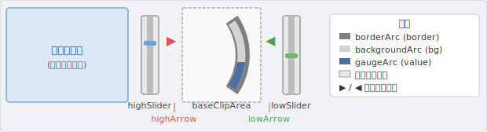
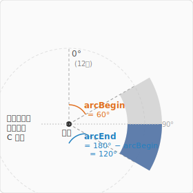
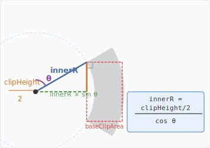
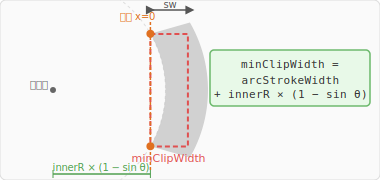
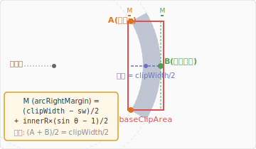
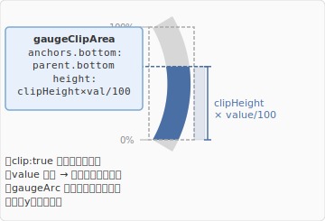
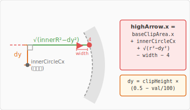
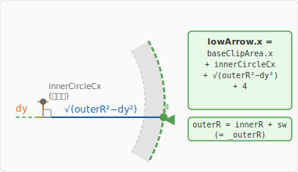
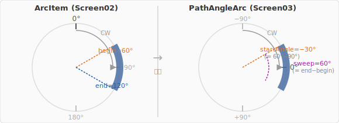
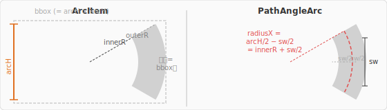

# Arc Gauge 計算の思想

Screen02 / Screen03 で実装した弧ゲージは、**「大きな円の一部を矩形でクリッピングして見せ隠しする」**方式でゲージ値を表現します。  
このドキュメントでは、各プロパティの導出過程を計算ステップごとに図付きで解説します。

---

## 目次

1. [全体構造](#1-全体構造)
2. [弧の角度定義](#2-弧の角度定義)
3. [弧のサイズ計算 — `_innerR` と `_arcH`](#3-弧のサイズ計算)
4. [クリップ幅の下限 — `_minClipWidth`](#4-クリップ幅の下限)
5. [弧の水平配置 — `_arcRightMargin` と `_innerCircleCx`](#5-弧の水平配置)
6. [ゲージ値の表示 — `gaugeClipArea` によるクリッピング](#6-ゲージ値の表示)
7. [マーカー矢印の配置 — `highArrow` と `lowArrow`](#7-マーカー矢印の配置)
8. [Screen03: `PathAngleArc` への移植](#8-screen03-pathanglearc-への移植)

---

## 1. 全体構造

画面は大きく 5 つの要素から成ります。



- **baseClipArea** : 弧を乗せる矩形クリップ領域。弧の形状パラメータが変わると幅・高さが連動する。  
- **gaugeArc** : `currentValue` に応じて下から塗られるゲージ色の弧。`gaugeClipArea` でクリップされる。  
- **highArrow / lowArrow** : それぞれ `highValue` / `lowValue` に応じて弧の内縁・外縁に吸い付く。

---

## 2. 弧の角度定義

ArcItem（および Screen03 の変換後 PathAngleArc）では角度を次のように定義します。



- `arcBegin` と `arcEnd = 180° − arcBegin` は **90° を軸に左右対称**。  
- 弧は右側（3時方向）に膨らむ **C 字型**で、上端が `arcBegin`、下端が `arcEnd` に対応。  
- ゲージ値 0% = 下端（arcEnd）、100% = 上端（arcBegin）。

---

## 3. 弧のサイズ計算

### `_innerR` の導出

設計上のキー制約：**弧の上端・下端が `baseClipArea` の上端・下端と一致する**ようにします。

円の中心を `baseClipArea` の垂直中心 (`clipHeight / 2`) に置くと、端点 (arcBegin = θ) から中心までの垂直距離は：

$$\Delta y = \text{innerR} \times \cos\theta$$

これが `clipHeight / 2` に等しくなる条件から：

$$\boxed{\text{innerR} = \frac{\text{clipHeight}/2}{\cos\theta}}$$



### `_arcH` の導出

ArcItem の描画方式では外縁がバウンディングボックス端に接するため、バウンディングボックスの高さは：

$$\text{arcH} = 2 \times (\text{innerR} + \text{arcStrokeWidth})$$

円の中心はバウンディングボックスの中央にあるので、外縁半径 = `innerR + arcStrokeWidth = outerR`。

> **Screen03 の PathAngleArc との違い**：PathAngleArc は strokeWidth の中心線が半径位置に来るため、半径 = `arcH/2 − arcStrokeWidth/2` を用います（詳細は[§8](#8-screen03-pathanglearchへの移植)）。

---

## 4. クリップ幅の下限

### `_minClipWidth` の導出

弧の端点（arcBegin の交点）が `baseClipArea` の **左端（x = 0）に来るギリギリの幅**が `_minClipWidth` です。



端点がちょうど左端に来るとき `_arcRightMargin = 0` であり、そのときの幅が：

$$\boxed{\text{minClipWidth} = \text{arcStrokeWidth} + \text{innerR} \times (1 - \sin\theta)}$$

`clipWidth < minClipWidth` のときは自動的に `_effectiveClipWidth = minClipWidth` に拡張されます。

---

## 5. 弧の水平配置

### `_arcRightMargin` の導出

弧の水平位置を決める条件：**弧の端点 x と外縁の最右端 x がそれぞれ `_arcRightMargin` だけクリップ領域の左右端から内側に来る**ように設計します。



- **A**（橙）= 弧の端点 x = `baseClipArea.left + M`  
- **B**（緑）= 外縁の最右端 x = `baseClipArea.right − M`  
- A と B が `arcRightMargin`（= M）だけ内側にあり、その中点が `clipWidth/2` になる。

$$\boxed{\text{arcRightMargin} = \frac{\text{clipWidth} - \text{sw}}{2} + \frac{\text{innerR} \times (\sin\theta - 1)}{2}}$$

### `_innerCircleCx` の導出

`borderArc` は `baseClipArea` の右端に `rightMargin = arcRightMargin` でアンカーされ、幅 = `_arcH`。その中心 x が円の中心になります：

$$\text{innerCircleCx} = \text{effectiveClipWidth} - \text{arcRightMargin} - \frac{\text{arcH}}{2}$$

> デフォルト値（clipHeight=250, arcBegin=60°, strokeWidth=50）では `innerCircleCx ≈ −208`。  
> 円の中心は `baseClipArea` の **208px 左外** に位置します。

---

## 6. ゲージ値の表示

`currentValue` (0〜100) を弧の塗られた範囲で表現するため、**下から高さを可変にする矩形クリップ**を使います。



```
gaugeClipArea {
    anchors.bottom: parent.bottom     // 常に baseClipArea の下端に固定
    height: clipHeight × currentValue / 100   // 値に応じて上方向に伸縮
    clip: true
}

gaugeArc {
    y: backgroundArc.y - gaugeClipArea.y   // gaugeClipArea の y 変動を補正
}
```

`gaugeClipArea` は下端固定で上端だけが動くため、弧の **下（0%）から塗られていく**自然なゲージ表現になります。

---

## 7. マーカー矢印の配置

### `highArrow` (▶) — 内円との交点

`highArrow` は弧の **内縁**（innerR）にぴったり接するように配置します。矢印の y 座標に対応する「内円との交点 x」を三平方の定理で求めます。



$$dy = \text{clipHeight} \times (0.5 - \text{highValue}/100)$$

$$\text{innerCircleX} = \text{baseClipArea.x} + \text{innerCircleCx} + \sqrt{\text{innerR}^2 - dy^2}$$

$$\text{highArrow.x} = \text{innerCircleX} - \text{width} - 4$$

---

### `lowArrow` (◀) — 外円との交点

`lowArrow` は弧の **外縁**（outerR）の右側からアプローチします。計算は `highArrow` と同じ構造ですが、使用する半径が `outerR = innerR + arcStrokeWidth` になります。



$$\text{lowArrowX}_{\text{outer}} = \text{baseClipArea.x} + \text{innerCircleCx} + \sqrt{\text{outerR}^2 - dy^2}$$

$$\text{lowArrow.x} = \text{lowArrowX}_{\text{outer}} + 4$$

`lowArrow`（◀）の左端を外縁の 4px 右に置くことで、矢印が弧のリングの右側から突き刺さるように見えます。

---

## 8. Screen03: `PathAngleArc` への移植

Screen02 は `ArcItem`（Qt Quick Studio Components）を使いますが、Screen03 では汎用性の高い `Shape` + `PathAngleArc` に置き換えます。2 つの間には **角度系** と **半径の定義** の違いがあります。

### 角度座標系の変換



| プロパティ | ArcItem | PathAngleArc |
|---|---|---|
| 0° の方向 | 上（12時） | 右（3時） |
| 角度の進む向き | 時計回り | 時計回り |
| ゲージの begin | `arcBegin` (例: 60°) | `startAngle = arcBegin − 90` (例: −30°) |
| ゲージの範囲 | `end − begin` | `sweepAngle = arcEnd − arcBegin` |

```qml
// Screen03 での変換
readonly property real _arcStartAngle: arcBegin - 90       // 例: 60 - 90 = -30
readonly property real _arcSweepAngle: arcEnd - arcBegin   // 例: 120 - 60 = 60
```

### 半径の変換

ArcItem は **外縁**がバウンディングボックス端に来る描画仕様ですが、PathAngleArc は **ストロークの中心線**が指定半径に来ます。



```qml
// PathAngleArc での半径指定
radiusX: root._arcH / 2 - root.arcStrokeWidth / 2   // = innerR + sw/2 (中心線)
radiusY: root._arcH / 2 - root.arcStrokeWidth / 2
```

---

## プロパティ一覧

| プロパティ | 型 | 説明 |
|---|---|---|
| `currentValue` | `int` (0–100) | ゲージ表示値 |
| `highValue` | `int` (0–100) | 上限マーカー (▶) |
| `lowValue` | `int` (0–100) | 下限マーカー (◀) |
| `clipWidth` | `real` | `baseClipArea` の幅 (最小値は `_minClipWidth`) |
| `clipHeight` | `real` | `baseClipArea` の高さ (= 弧の垂直スパン) |
| `arcBegin` | `real` (45–75°) | 弧の開始角度 |
| `arcStrokeWidth` | `real` | 弧のストローク幅 |
| `_theta` | `real` | `arcBegin` のラジアン値 |
| `_innerR` | `real` | 弧の内縁半径 |
| `_outerR` | `real` | 弧の外縁半径 (`= _innerR + arcStrokeWidth`) |
| `_arcH` | `real` | 弧のバウンディングボックス高さ |
| `_effectiveClipWidth` | `real` | `max(clipWidth, _minClipWidth)` |
| `_arcRightMargin` | `real` | `borderArc` の右マージン |
| `_innerCircleCx` | `real` | 円中心の `baseClipArea` 内 x 座標 |
| `_highArrowDy` | `real` | `highArrow` の y に対応する円中心からの dy |
| `_lowArrowDy` | `real` | `lowArrow` の y に対応する円中心からの dy |
